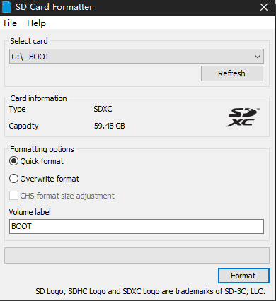
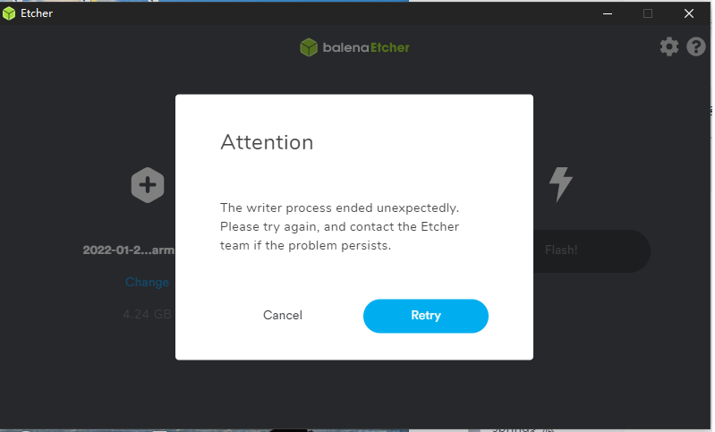
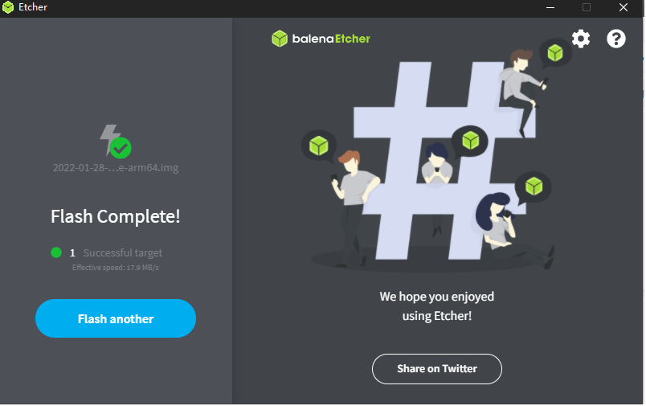

> **etcher**
http://downza.91speed.com.cn/2022/02/24/Etcher.rar?timestamp=624104d7&auth_key=40e6db4bcbb782f09e9d357008bd799f&sign=e363bed7966cc50ddc573ceca04e1a96&t=624112e7
>
>**os**
https://shumeipai.nxez.com/download#os

>**sd card formatter**
http://www.downza.cn/soft/291378.html
>
>**材料**
 >1. 树莓派4b主板
 >2. sd卡和读卡器
 
 **烧录系统** 
 >1.先格式化sd卡
 >>

 >2.将下载好的镜像使用工具烧录到sd卡上
 在烧录的过程中出现报错
 
 先关掉所有的杀毒软件，我使用的etcher是1.5.8升级到1.7.7 就可以烧录成功了
 

 >3 在系统分区里新建两个文件
 >>一个空白ssh的文件  
 >>一个wpa_supplicant.conf 设置自己的wifi
>>>
>>>       country=CN
>>>       ctrl_interface=DIR=/var/run/wpa_supplicant GROUP=netdev
>>>       update_config=1
>>>       network={
>>>          ssid="WiFi-A"
>>>          psk="12345678"
>>>          key_mgmt=WPA-PSK
>>>          priority=1
>>>       }
>>>       network={
>>>          ssid="WiFi-B"
>>>          psk="12345678"
>>>          key_mgmt=WPA-PSK
>>>          priority=2
>>>          scan_ssid=1
>>>       }  

  
