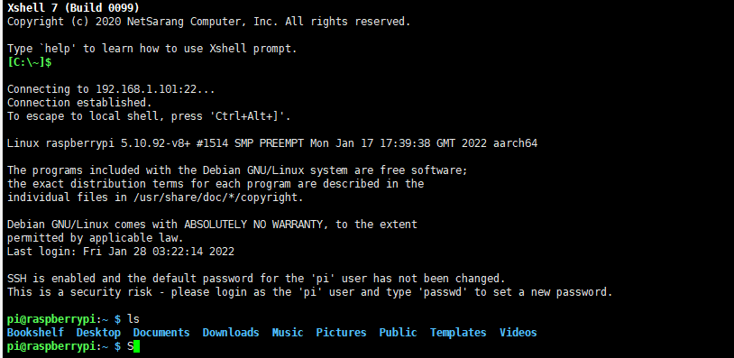

>**SSH 连接树莓派**
>> 由于我没有买其他的配件(显示器,无线键盘..)  所以用的是ssh来远程树莓派
>> 我在初始化的时候就已经配置了ssh 和wifi的配置，树莓派通电后系统初始化会开启ssh功能和连上wifi
>> 先进入路由器管理界面查看树莓派的ip地址
>> 

>>> 树莓派默认的SSH用户名是: <kbd>pi</kbd>,密码是: <kbd>raspberry</kbd>。

>>>连接成功
>

>>>外网访问的话还需要frp内外穿透