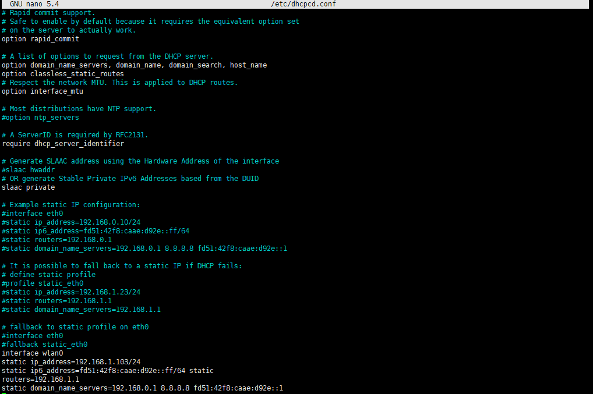
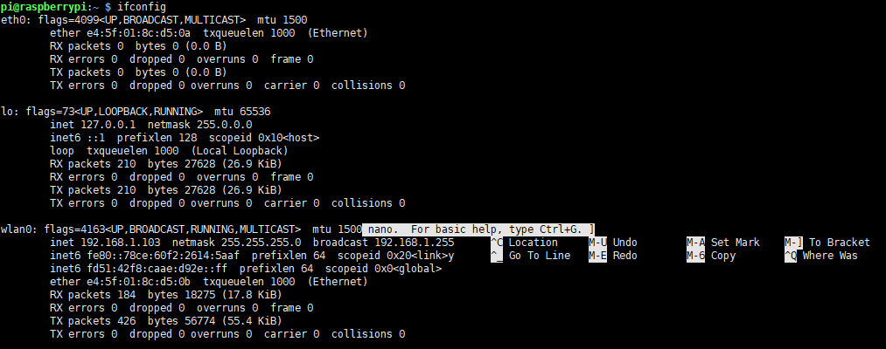

****
>> 路由器的DHCP服务器经常会给树莓派分配不同的IP地址,每次关机后都需要登录路由器查看ip修改ssh配置比较麻烦

>> 使用修改配置文件的方式设置静态ip
>>> sudo nano /etc/dhcpcd.conf
>
>> 在文件后追加 
>>>```
>>>interface wlan0 static ip_address=192.168.1.103/24 （设置固定ip）
>>>static ip6_address=fd51:42f8:caae:d92e::ff/64
>>>static routers=192.168.1.1  （路由器管理页面的ip）
>>>static domain_name_servers=192.168.1.1 8.8.8.8 fd51:42f8:caae:d92e::1

>>>

>>>保存退出重启并查看

>>>
